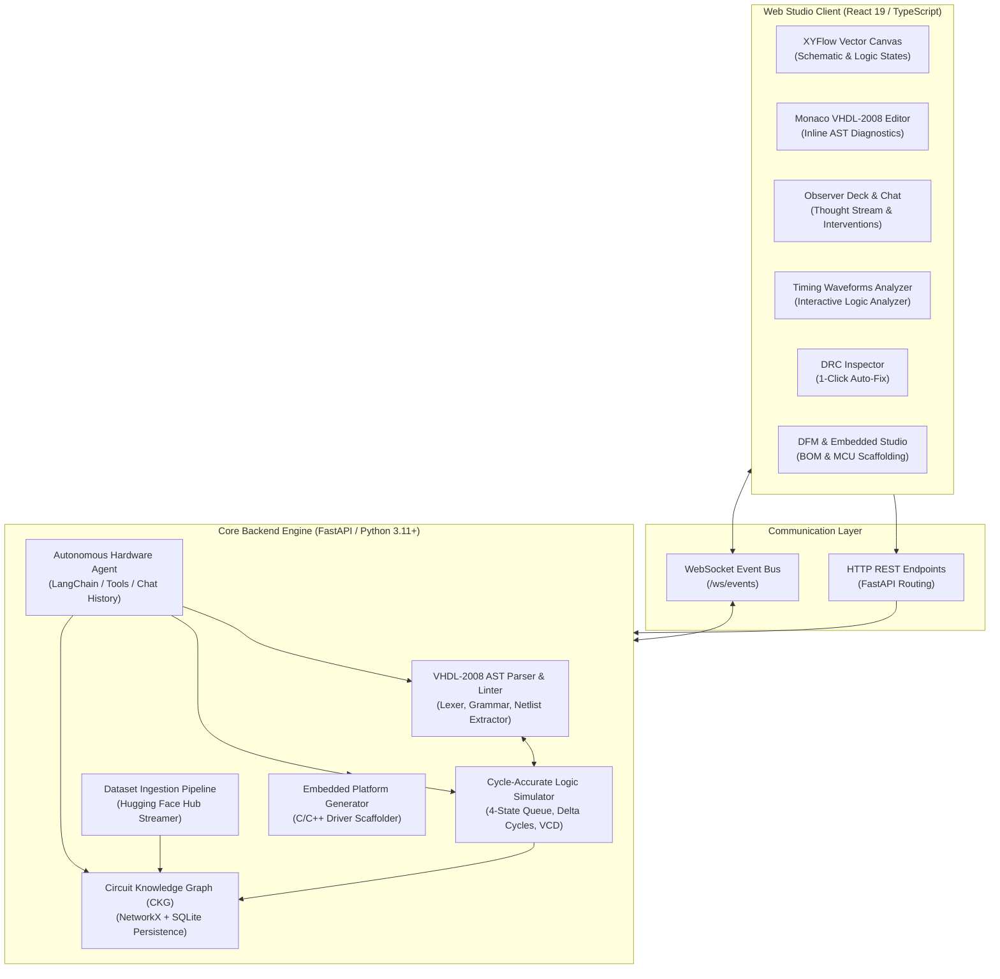
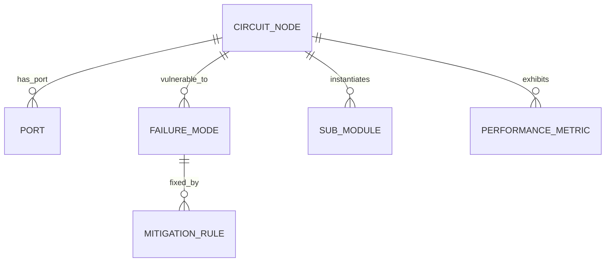

# 🏛️ CircuitForge EDA Studio — System Architecture

This technical specification details the internal architecture, component interactions, data pipelines, simulation mechanics, and reactive synchronization protocols powering the **CircuitForge EDA Studio**.

---

## 1. High-Level Architecture Overview

CircuitForge is structured as a decoupled, full-stack client-server system:
- **Backend (Python 3.11+ / FastAPI)**: Hosts the cycle-accurate event-driven logic simulator, VHDL-2008 AST parser, continuous-learning Circuit Knowledge Graph (CKG), autonomous hardware AI agent, and embedded firmware generator.
- **Frontend (React 19 / TypeScript / Vite / Tailwind CSS)**: Houses the interactive XYFlow vector schematic canvas, Monaco code editor, DRC inspector drawer, digital logic analyzer, and human-in-the-loop agent observer deck.
- **Real-Time Communication (WebSockets & REST)**: Synchronizes state transitions, streaming simulation ticks, agent thinking tokens, and live telemetry.



---

## 2. Core Backend Subsystems

The backend application lives in `backend/app/` and is organized into modular services:

### 2.1 FastAPI Application Layer (`backend/app/main.py`)
- **Routing & Endpoints**: Dispatches project management, file operations, DRC analysis, simulation requests, and agent interventions.
- **WebSocket Connection Manager**: Manages client socket lifetimes, broadcasting streaming thought tokens, simulation steps, and graph mutation pulses.
- **CORS & Middleware**: Configured with strict localhost security boundaries while allowing decoupled Vite dev server proxies.

### 2.2 VHDL-2008 AST Parsing & Netlist Synthesis Engine (`backend/app/parser/`)
The AST parser performs lexical analysis and recursive descent parsing of IEEE 1076-2008 VHDL source files:
- **Tokenization (`lexer.py`)**: Tokenizes reserved words, identifiers, bit literals (`'0'`, `'1'`, `'Z'`, `'X'`), vector literals (`"1010"`), and standard operators.
- **AST Nodes**:
  - `EntityNode`: Captures port declarations, generics, and entity interfaces.
  - `ArchitectureNode`: Captures internal signal declarations, process blocks, and component instantiations.
  - `ProcessNode`: Captures sequential sensitivity lists and conditional statements (`if-then-else`, `case-when`).
  - `ComponentInstanceNode`: Tracks child module instantiations and port mappings.
- **Two-Way Netlist Synthesis**:
  - *Code to Netlist*: Parses VHDL AST and reconstructs XYFlow nodes and electrical edges.
  - *Netlist to Code*: Converts visual components and wire topologies back into valid VHDL-2008 structural architectures without modifying user comments or external declarations.

---

## 3. Cycle-Accurate Logic Simulation Engine

Located in `backend/app/simulator/`, the simulator provides cycle-accurate digital verification with zero external binary dependencies (e.g. GHDL or ModelSim not required).

### 3.1 Mathematical Foundation: 4-State Logic Algebra
CircuitForge models digital circuits using the IEEE 1164 4-state logic system:
$$\mathcal{L} = \{ \text{'0'}, \text{'1'}, \text{'Z'}, \text{'X'} \}$$
Where:
- `'0'`: Logic Low / Ground (0 V).
- `'1'`: Logic High / VDD (3.3 V / 1.8 V / 1.0 V).
- `'Z'`: High-Impedance / Tri-State (floating net).
- `'X'`: Unknown / Contention (two active drivers driving conflicting levels, or uninitialized state).

### 3.2 Event-Driven Scheduling with Delta Cycles
Simulation operates via a discrete event priority queue sorted by timestamp:
$$t = (\tau, \delta)$$
Where $\tau \in \mathbb{N}_0$ is the simulation time (nanoseconds), and $\delta \in \mathbb{N}_0$ is the delta cycle counter.
1. **Event Evaluation**: When an input signal or clock edge toggles at $(\tau, 0)$, all connected downstream gates evaluate their transfer functions.
2. **Delta Cycle Resolution**: Output changes are scheduled at $(\tau, \delta + 1)$. The engine loops through delta iterations until all combinational signal states stabilize (quiescence) before advancing simulation time to $\tau + 1$.
3. **Hazard & Oscillation Detection**: If $\delta > 1000$ within a single time step $\tau$, an unstable combinational feedback loop (ring oscillator or race condition) is flagged.

### 3.3 IEEE 1364 VCD Export
As values transition, changes are formatted into standard IEEE 1364 Value Change Dump (VCD) syntax with compressed ASCII identifiers, enabling native import into industry tools such as GTKWave and Sigrok.

---

## 4. Circuit Knowledge Graph (CKG) & Continuous Learning

The CKG subsystem (`backend/app/knowledge/`) serves as the collective memory and learning engine of CircuitForge.

### 4.1 Hybrid Storage Architecture
- **In-Memory Graph (`NetworkX`)**: Provides fast sub-millisecond graph traversals, centrality calculations, and shortest-path queries.
- **Relational Persistence (`SQLite`)**: Persists graph topology, node metadata, and failure mitigations to disk (`data/circuit_knowledge_graph.db`).

### 4.2 Entity & Relation Ontology



- **Nodes**:
  - `Entity`: Named hardware block (`CLA_32bit`, `UART_Core`, `RV32I_ALU`).
  - `Scale`: Abstraction classification (`Scale1_Gate`, `Scale2_RTL`, `Scale3_Subsystem`, `Scale4_Processor`).
  - `FailureMode`: Known electronic hazards (`Metastability`, `Inferred Latch`, `Clock Jitter`, `Ground Bounce`).
  - `MitigationRule`: Recommended engineering fixes (`Double-Flop Synchronizer`, `Full Case-When Coverage`, `Decoupling Capacitors`).
- **Edges**:
  - `INSTANTIATES`: Hierarchical composition.
  - `CONNECTS_TO`: Signal routing between ports.
  - `VULNERABLE_TO`: Links a module to a potential failure mode under specific timing conditions.
  - `FIXED_BY`: Prescribes the corrective engineering pattern.

### 4.3 Autonomous Feedback Loop
Whenever an autonomous simulation or DRC check fails:
1. The agent extracts the failure signature (e.g. `AssertionError: Setup violation on net clk_div`).
2. The agent queries the CKG for known `FIXED_BY` mitigation rules.
3. Upon applying the fix and verifying that simulation passes, the CKG logs a new empirical benchmark and increases the confidence score of the mitigation edge.

---

## 5. Autonomous Hardware Agent Subsystem

The AI Co-Pilot (`backend/app/agent/`) is an autonomous hardware engineer capable of reasoning, planning, editing files, and running diagnostics.

### 5.1 Multi-Turn Conversational Memory
The agent maintains full state awareness:
- Active project name and complete directory tree.
- List of open files and their contents.
- Real-time schematic netlist topology.
- DRC violation diagnostics bundle.
- Past user steering prompts and conversational turns.

### 5.2 Tool Execution Sandbox
The agent has access to specialized hardware tools:
- `read_file` / `write_file`: Read and write VHDL sources and testbenches.
- `run_drc_check`: Run full design rule audit on current schematic netlist.
- `auto_fix_drc`: Automatically inject termination resistors or ground ties to clear all DRC issues.
- `run_simulation`: Execute event-driven simulation with specified clock and stimulus.
- `query_ckg`: Query the Circuit Knowledge Graph for design patterns and failure modes.

### 5.3 Human-in-the-Loop Observer Deck
The agent operates under continuous supervisory control:
- **`Pause`**: Intercepts execution before the next tool call is executed.
- **`Step`**: Advances exactly one tool call, returning control to the human observer.
- **`Steer`**: Allows the user to inject natural language instructions mid-flight, redirecting the agent's goal.
- **`Resume`**: Resumes continuous autonomous execution.

---

## 6. Frontend Reactive Architecture

The client application (`web/src/`) is built with React 19, TypeScript, and Tailwind CSS.

### 6.1 Core Component Tree
```
App.tsx
├── Header.tsx (Project Hub trigger, scale badge, sim controls, drawer toggles)
├── ProjectManagerModal.tsx (Project creation, template selection, switching)
├── Canvas.tsx (XYFlow vector schematic canvas, node renderers, wire routing)
├── CodeEditor.tsx (Monaco editor instance, AST diagnostics, sync bridge)
├── AgentDeck.tsx (Chat interface, thought streams, intervention toolbar)
├── DrcDrawer.tsx (DRC violation list, 1-click Auto-Fix trigger)
├── WaveformDrawer.tsx (Digital timing analyzer, cursor measurements, VCD download)
├── KnowledgeGraphModal.tsx (Force-directed 2D topology visualizer)
├── HardwareLifecycleDeck.tsx (BOM generator, DFM analysis, thermal checks)
└── EmbeddedPlatformModal.tsx (MCU target selector, C/C++ driver scaffolder)
```

### 6.2 Bidirectional Canvas-to-Code Synchronization Protocol
To prevent clobbering manual edits while ensuring visual changes reflect in VHDL:
1. When a component is dragged, deleted, or re-wired on the canvas, `syncNetlistToCode` triggers.
2. The active design file path is resolved dynamically from the open editor buffer.
3. The schematic netlist is serialized into VHDL-2008 structural syntax.
4. The Monaco model value and the active project file buffer are updated atomically with path normalization, preventing out-of-sync discrepancies.

---

## 7. Performance & Scalability Design

- **Sub-Second Linting**: Debounced AST parsing executes in <15 ms for 1,000-line VHDL files using regex-assisted recursive descent.
- **Vector Canvas Virtualization**: XYFlow only renders SVG elements within the active viewport, ensuring 60 FPS performance on schematics with 500+ logic gates.
- **Zero-Allocation Simulation Queue**: Event priority queues utilize binary heaps (`heapq`) in Python, processing up to 250,000 signal transitions per second.\n