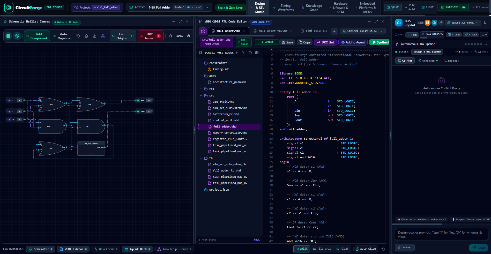
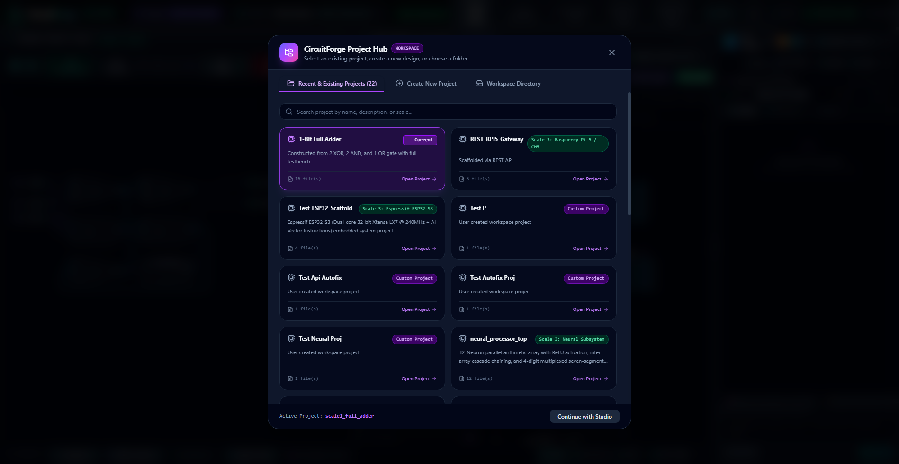
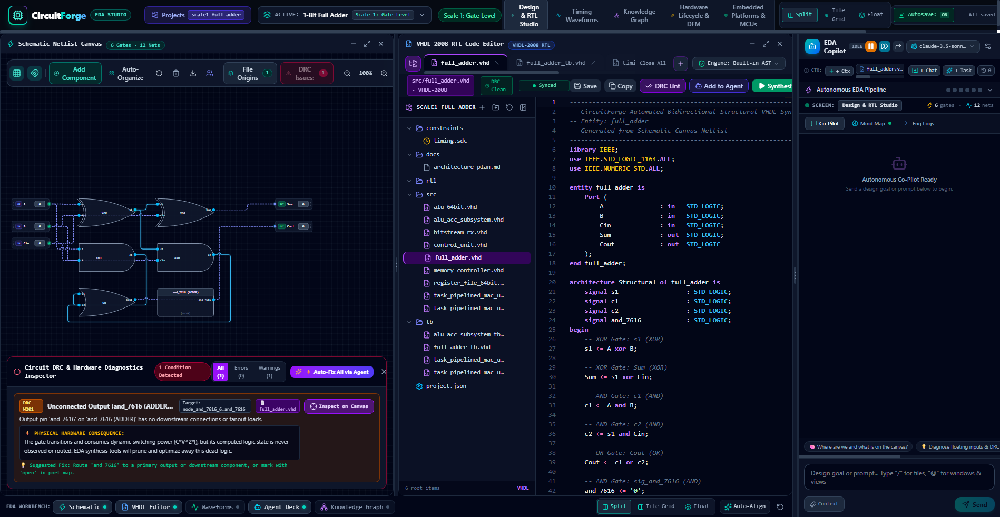
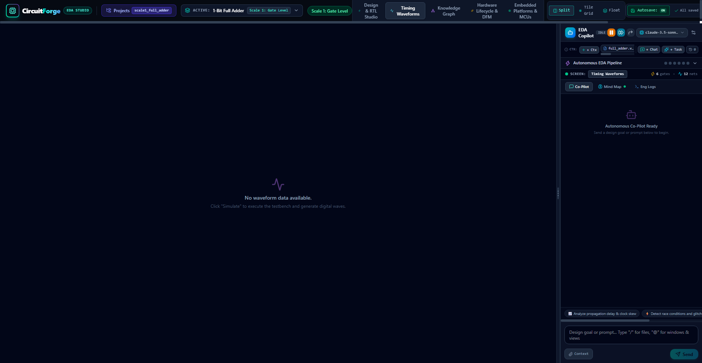
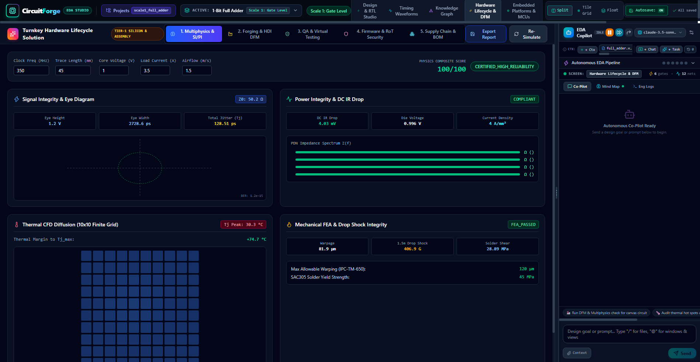
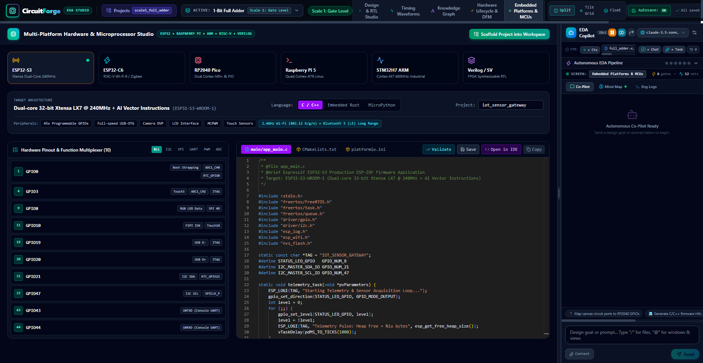

# 📖 CircuitForge EDA Studio — Operator & User Manual

Welcome to the **CircuitForge User Guide**. This comprehensive handbook provides step-by-step instructions, operational workflows, architectural insights, and best practices for designing, simulating, linting, auto-repairing, and deploying digital hardware using CircuitForge.

---

## Table of Contents
1. [Introduction & System Requirements](#1-introduction--system-requirements)
2. [Studio Workspace Orientation](#2-studio-workspace-orientation)
3. [Multi-Scale Project Management](#3-multi-scale-project-management)
4. [Interactive Schematic Canvas](#4-interactive-schematic-canvas)
5. [Monaco VHDL-2008 Code Editor & AST Linting](#5-monaco-vhdl-2008-code-editor--ast-linting)
6. [Design Rule Checking (DRC) & 1-Click Autonomous Auto-Fix](#6-design-rule-checking-drc--1-click-autonomous-auto-fix)
7. [Cycle-Accurate Logic Simulation & Timing Waveforms](#7-cycle-accurate-logic-simulation--timing-waveforms)
8. [Autonomous Hardware Agent Co-Pilot](#8-autonomous-hardware-agent-co-pilot)
9. [Circuit Knowledge Graph (CKG) Exploration](#9-circuit-knowledge-graph-ckg-exploration)
10. [Turnkey Hardware Lifecycle & DFM Manufacturing](#10-turnkey-hardware-lifecycle--dfm-manufacturing)
11. [Embedded Platforms & Microcontroller Firmware Studio](#11-embedded-platforms--microcontroller-firmware-studio)
12. [Keyboard Shortcuts & Power-User Reference](#12-keyboard-shortcuts--power-user-reference)
13. [Troubleshooting & Frequently Asked Questions](#13-troubleshooting--frequently-asked-questions)

---

## 1. Introduction & System Requirements

CircuitForge is a unified Electronic Design Automation (EDA) and embedded co-pilot environment that enables engineers and autonomous AI agents to co-design digital electronic systems across four orders of abstraction magnitude:
1. **Transistors & CMOS Logic Primitives**
2. **RTL Arithmetic & Datapath Units**
3. **Subsystems & IP Cores**
4. **Complete Microprocessors (RISC-V) & Embedded Platforms**

### System Requirements
- **Operating System**: Windows 10/11, macOS Sonoma+, or Linux (Ubuntu 22.04+ recommended)
- **Runtime**: Python 3.11 or newer
- **Browser**: Google Chrome, Microsoft Edge, Brave, or Mozilla Firefox (modern Chromium browser recommended for hardware acceleration)
- **Node.js**: v18.0.0+ and npm 9.0+ (required for web frontend development)
- **Memory**: Minimum 4 GB RAM (8 GB+ recommended for complex RISC-V pipelined simulations)

---

## 2. Studio Workspace Orientation

Upon opening the studio at `http://127.0.0.1:8000` (or `http://localhost:5173` in development mode), you are greeted by the main workbench:

The interface is structured into six synchronized operational zones:

1. **Top Navigation Bar**:
   - **Project Switcher & Manager**: Shows the active project name (`scale1_full_adder`, `neuron`, etc.). Clicking opens the Project Hub.
   - **Scale Indicator**: Displays current abstraction tier (Scale 1 to Scale 4).
   - **Simulation Controls**: `Run Simulation`, `Reset`, `Step Cycle`, and clock speed toggles.
   - **Utility Drawers**: Buttons to toggle the **DRC Inspector**, **Timing Waveforms**, **Circuit Knowledge Graph**, **Hardware Lifecycle / DFM**, and **Embedded MCUs**.
2. **Left Component Palette**:
   - Categorized library of logic gates (`AND`, `OR`, `XOR`, `NAND`, `NOR`, `NOT`), sequential elements (`DFF`, `Latch`, `Counter`), arithmetic blocks (`Adder`, `ALU`, `Multiplier`), and I/O ports (`Input`, `Output`, `Clock`).
   - Simply drag any element directly onto the schematic canvas.
3. **Center-Left: Interactive Vector Schematic Canvas**:
   - Vector rendering powered by React Flow / XYFlow.
   - Displays component symbols, input/output pins, interconnecting wires, and live signal logic levels.
4. **Center-Right: Monaco VHDL-2008 Code Editor**:
   - Full-featured code editor with syntax highlighting, line numbers, code folding, and real-time AST linting diagnostics.
5. **Right Dock: Autonomous Hardware Agent Deck**:
   - Interactive chat interface with the LLM Hardware Engineer.
   - Live thought stream (`PLANNING`, `LINTING`, `SYNTHESIZING`, `SIMULATING`).
   - Human-in-the-Loop intervention controls (`Pause`, `Step`, `Resume`, `Steer`, `Inject Fault`).
6. **Collapsible Bottom Drawers**:
   - **DRC Inspector**: Lists all design rule violations with severity badges and 1-click Auto-Fix.
   - **Timing Waveforms**: Multi-channel digital logic analyzer.
   - **Lifecycle & DFM**: Bill of Materials (BOM), thermal/voltage checks, and Gerber exports.
   - **Embedded Platforms**: C/C++ driver scaffolding and GPIO pinout assignments.

---

## 3. Multi-Scale Project Management

CircuitForge manages hardware designs as isolated, self-contained project workspaces.

### Managing Projects
1. **Opening the Project Hub**: Click the project name or folder icon in the top header.
2. **Creating a New Project**:
   - Enter a unique project name (e.g. `riscv_core`, `neural_synapse`).
   - Choose a starter template:
     - *Scale 1*: CMOS Gates & Master-Slave Flip-Flops.
     - *Scale 2*: 32-bit Carry Lookahead Adder or Synchronous FIFO.
     - *Scale 3*: Multi-Function ALU or Full-Duplex UART IP Core.
     - *Scale 4*: 5-Stage Pipelined RV32I Processor.
     - *Blank Project*: Empty schematic and VHDL scaffold.
   - Click **Create Project**.
3. **Switching Projects**: Click any project card in the modal to load its canvas state, VHDL sources, testbenches, and DRC status instantly.
4. **Exporting Projects**: Click the **Export Archive** icon to download a zip containing all VHDL files, netlists, VCD waveforms, and project manifests.

---

## 4. Interactive Schematic Canvas

The vector schematic canvas is your primary visual hardware workspace:

### Basic Operations
- **Pan**: Click and drag any empty canvas area, or hold `Space` while dragging.
- **Zoom**: Scroll your mouse wheel, or use the `+` / `-` controls on the bottom-left navigation bar.
- **Adding Components**: Drag any component from the left palette and release it onto the canvas.
- **Selecting & Moving**: Click any component node to select it; drag to reposition. Hold `Shift` to multi-select nodes.
- **Wiring Components**:
  1. Hover your cursor over an output pin (circle on the right of a component).
  2. Click and drag towards a destination input pin.
  3. Release when the target pin highlights green to establish the electrical net.
- **Deleting Elements**: Select any node or wire and press `Delete` or `Backspace`.
- **Dynamic Netlist Sync**: Every component placed, wire drawn, or node removed automatically re-synthesizes the netlist and updates the Monaco VHDL code editor in real time!

### Live Logic State Overlays
During simulation runs or static logic evaluation, wires and pins dynamically change colors to reflect real-time electrical potential:
- **Dark Slate Gray**: Logic Low (`'0'`).
- **Bright Emerald Green**: Logic High (`'1'`).
- **Amber Yellow**: High-Impedance (`'Z'`).
- **Bright Crimson Red**: Unknown / Contention (`'X'`).

### Hierarchical Drill-Down
Subsystems such as ALUs, FIFOs, and Multipliers can be double-clicked to navigate inside their internal subcircuit implementation. Use the breadcrumb bar at the top of the canvas to navigate back up the hierarchy.

---

## 5. Monaco VHDL-2008 Code Editor & AST Linting

The Monaco editor provides an industrial-grade code editing experience customized for IEEE 1076-2008 VHDL.

### Key Capabilities
- **Syntax Highlighting & Formatting**: Full support for VHDL keywords, signal declarations, process blocks, and component instantiations.
- **Inline AST Diagnostics**: As you type, the backend AST parser continually validates the code syntax and semantics. Any syntax error, undeclared identifier, or port type mismatch appears immediately with red squiggly underlines and line margin markers.
- **Bidirectional Dynamic Sync**:
  - Modifying the visual schematic updates the VHDL code editor buffer immediately.
  - Editing the VHDL code and pressing `Ctrl+S` (or letting the editor debounce) parses the AST and updates the visual schematic nodes and netlist.

---

## 6. Design Rule Checking (DRC) & 1-Click Autonomous Auto-Fix

CircuitForge incorporates a hardware validation engine that checks your design against industry standard physical and logical design rules.

### What Rules Are Checked?
1. **Floating Inputs (`DRC_FLOAT`)**: Warns whenever a logic gate or subsystem input pin is left floating without a driving signal or pull-up/pull-down resistor.
2. **Bus Contention (`DRC_CONTENTION`)**: Identifies nets driven simultaneously by multiple active outputs without tri-state control.
3. **High Fanout Violations (`DRC_FANOUT`)**: Detects output nets driving more loads than the maximum allowed gate threshold, causing potential signal degradation.
4. **Clock Domain Crossing (`DRC_CDC`)**: Flags asynchronous signals crossing between disparate clock domains without multi-stage synchronizers.
5. **Dangling Nets (`DRC_DANGLING`)**: Detects wires with unconnected endpoints.

### 1-Click Autonomous DRC Auto-Fix
When violations are detected:
1. Open the **DRC Inspector** drawer at the bottom of the studio.
2. Review the list of issues, impacted component IDs, and suggested remediation steps.
3. Click the prominent **⚡ Auto-Fix All via Agent** button.
4. The Autonomous Co-Pilot receives the complete diagnostic bundle, determines the exact fixes required (e.g. tying floating inputs to GND/VCC or inserting pull resistors), modifies the VHDL code, updates the schematic, and re-runs DRC.
5. The DRC drawer updates immediately to **0 Violations (All Clear)**.

---

## 7. Cycle-Accurate Logic Simulation & Timing Waveforms

CircuitForge features a cycle-accurate, 4-state event-driven simulation engine.

### Running a Simulation
1. Set the **Clock Frequency** and **Cycles to Run** in the top navigation bar.
2. Define stimulus vectors or click **Auto-Generate Stimulus** to sweep through all input combinations.
3. Click **Run Simulation**.
4. The simulation executes with delta cycles, resolving gate propagation delays and sequential flip-flop transitions.

### Using the Digital Logic Analyzer
- **Timeline Cursor**: Click anywhere on the waveform canvas to place a measurement cursor. The value of every signal at that exact time instant is displayed in the sidebar.
- **Zoom & Pan**: Use the zoom slider or scroll wheel to inspect nanosecond-level transitions or zoom out to view thousands of clock cycles.
- **Radix Switching**: Right-click or toggle multi-bit bus signals to display values in **Hexadecimal (`0x`)**, **Binary (`0b`)**, or **Unsigned Decimal**.
- **Live Fault Injection**: Click **Inject Fault** during simulation to force any net to stuck-at-0 or stuck-at-1, allowing you to evaluate circuit fault tolerance and error recovery.
- **Exporting VCD**: Click **Download VCD** to save the standard IEEE 1364 Value Change Dump file for external analysis in GTKWave or ModelSim.

---

## 8. Autonomous Hardware Agent Co-Pilot

CircuitForge integrates an autonomous AI hardware engineer that acts as a collaborative pair programmer.

### Agent Capabilities
- **File System & Project Awareness**: The agent inspects the project tree, reads design documentation, reads VHDL source code, and writes updates.
- **Multi-Turn Chat History**: Retains conversational context, prior decisions, and debugging steps.
- **Tool-Augmented Action Space**: The agent can autonomously run DRC checks, trigger logic simulations, inspect timing results, and update schematics.

### Human-in-the-Loop Observer Deck
The observer deck gives you complete oversight and control:
- **Live Thought Stream**: Shows the agent's internal monologue and current operational phase (`PLANNING`, `DESIGNING`, `LINTING`, `SYNTHESIZING`, `SIMULATING`).
- **Intervention Controls**:
  - `[Pause]`: Halts autonomous execution before the next action.
  - `[Step]`: Allows the agent to execute a single action, then pauses for your review.
  - `[Resume]`: Restores continuous autonomous execution.
  - `[Steer]`: Opens an input box to inject corrective guidance mid-execution.
  - `[Inject Fault]`: Forces a hardware error to test the agent's autonomous debugging and recovery abilities.

---

## 9. Circuit Knowledge Graph (CKG) Exploration

The Circuit Knowledge Graph (CKG) is a continuously learning semantic network backing CircuitForge.

### Exploring the CKG
1. Click the **Knowledge Graph** button in the top navigation bar.
2. The force-directed graph displays hardware modules, architectural patterns, and known failure modes (`Metastability`, `Inferred Latch`, `Clock Jitter`).
3. Nodes are color-coded by abstraction scale:
   - Yellow: Gate Primitives (Scale 1)
   - Teal: RTL Datapath (Scale 2)
   - Purple: Subsystems & IP (Scale 3)
   - Red: Processors & Systems (Scale 4)
   - Orange: Failure Modes & Mitigation Rules
4. **Hugging Face Hub Ingestion**: Click **Ingest Open-Source Dataset** to fetch verified VHDL/Verilog modules from Hugging Face Hub (e.g. `shailja/Verilog_Github`) and automatically index them into the local knowledge base.

---

## 10. Turnkey Hardware Lifecycle & DFM Manufacturing

Move your design from virtual simulation to physical fabrication with the Turnkey Hardware Lifecycle Deck.

### Features
- **Automated Bill of Materials (BOM)**: Aggregates all components, packages, quantities, manufacturer part numbers (MPNs), and estimated unit costs.
- **Footprint & SMT Validation**: Confirms package footprints (e.g. SOIC-14, TSSOP-20, QFP-64) match standard manufacturing design rules.
- **Thermal & Voltage Tolerance Audit**: Evaluates power dissipation ($P = I^2 R + C V^2 f$) and highlights components exceeding recommended thermal budgets.
- **Export Package**: Download complete manufacturing bundles including BOM CSV, Pick-and-Place coordinates, and netlist files ready for PCB layout tools.

---

## 11. Embedded Platforms & Microcontroller Firmware Studio

Bridge hardware logic and embedded software using the Embedded Platforms Studio.

### Supported Platforms
- **Espressif ESP32-S3** (Dual-Core Xtensa LX7, 240 MHz, Wi-Fi & BLE 5.0)
- **Raspberry Pi RP2040** (Dual-Core ARM Cortex-M0+, 133 MHz, PIO state machines)
- **Raspberry Pi 5** (Quad-Core ARM Cortex-A76, 2.4 GHz, PCIe & RP1 I/O Controller)

### Firmware Scaffolding Workflow
1. Select your target microcontroller from the platform selector.
2. Review the memory-mapped I/O register layout generated from your circuit's ports.
3. Click **Scaffold C/C++ Driver**: CircuitForge generates complete bare-metal header files (`circuit_regs.h`), initialization routines, and read/write register access macros.
4. Inspect the **Physical Pinout & Wiring Diagram** to verify hardware connections between your microcontroller's GPIOs and the simulated circuit.

---

## 12. Keyboard Shortcuts & Power-User Reference

| Shortcut | Action | Scope |
| :--- | :--- | :--- |
| `Ctrl + S` / `Cmd + S` | Save active file & sync netlist | Editor / Canvas |
| `Space + Drag` | Pan schematic canvas | Canvas |
| `Ctrl + +` / `Ctrl + -` | Zoom in / Zoom out | Canvas / Waveforms |
| `Delete` / `Backspace` | Delete selected node or wire | Canvas |
| `Ctrl + Enter` | Send prompt to Autonomous Agent | Agent Deck |
| `Ctrl + Shift + D` | Toggle DRC Inspector Drawer | Global |
| `Ctrl + Shift + W` | Toggle Timing Waveforms Drawer | Global |
| `Ctrl + Shift + K` | Toggle Knowledge Graph View | Global |
| `Esc` | Deselect all nodes / close active modal | Global |

---

## 13. Troubleshooting & Frequently Asked Questions

### Q: Why is my VHDL code not updating when I add a component on the canvas?
**A**: Ensure you have an active design file open in the editor (`.vhd`). The canvas synchronizes dynamically with the active VHDL file. If synchronization was paused, click **Save & Sync** in the editor toolbar.

### Q: Why did the DRC Inspector flag a "Floating Input" error?
**A**: Digital logic gates require defined binary logic levels at all input pins. Floating pins pick up capacitive noise in physical silicon. Connect the pin to a signal, or click **⚡ Auto-Fix All via Agent** to let the co-pilot automatically tie unused inputs to safe default values.

### Q: How do I view waveforms for internal signals inside a submodule?
**A**: Double-click the submodule on the schematic canvas to enter its hierarchical view. All internal nets will appear in the signal list of the Timing Waveforms drawer.

### Q: Can I run CircuitForge completely offline?
**A**: Yes! CircuitForge contains a self-hosted event-driven logic simulator, an embedded SQLite knowledge graph, and bundled multi-scale hardware templates. An internet connection is only required if you choose to query cloud LLM APIs or download new datasets from Hugging Face Hub.\n